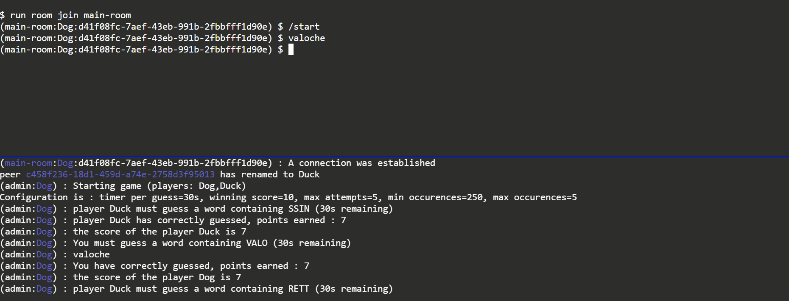

# WordGuessingSolo

This is a game where you have to find a word containing a randomly provided sequence of letters.

It is a multiplayer online version, using WebRTC to communicate with players, the interface mimic a command line.

You can find a running version in [word-guessing-multi-xterm-pages](https://github.com/isirode/word-guessing-multi-xterm-pages).

The database is build in my [HunspellSQLiteGenerator](https://github.com/isirode/HunspellSQLiteGenerator) project.

The database is originally provided by [Grammalecte](https://grammalecte.net/) (license MPL 2.0).

## Features

- Get a sequence of letter in:
  - French (using Grammecte)
  - Wiktionary (using Wiktionary)
- Configure
  - Min number of occurences of the sequence
  - Max number of occurences of the sequence
  - Max number of attempts to guess a word containing the sequence

- Play in multiplayer
  - Create a room to play in
  - Publish to a server for other players to join
  - It is played using WebRTC (P2P), you do not communicate with the server for this
  - The server is only used to hold the definition of the rooms and helping the players connect themselves
- Chat in the room
- The gamemplay is different when playing in multiplayer: 
  - you have a fix amount of time to guess a word containing the transmitted sequence
  - you win after a certain amount of points earned (based on the length of the word, 1 letter = 1 points)

## Running the project

You can use Parcel + Yarn : 'yarn start'

## Importing the project

Nothing here yet.

### Dependencies

Nothing here yet.

## Know issues

- The peerjs-server-room fork is not published yet
  - So you cannot use the project for now
- Some functionalities are not present yet
- It is a work in progress

- It will not work in Firefox in private mode
  - This is due to the game using the local storage, but local storage not being available in private browsing

## Partipating

Open the [DEVELOPER.md](./DEVELOPER.md) section.

## License

It is provided with the GNU AFFERO GENERAL PUBLIC LICENSE.

This is a multiplayer game where you have to find a word containing a randomly provided sequence of letters.

Copyright (C) 2023  Isirode

This program is free software: you can redistribute it and/or modify
it under the terms of the GNU Affero General Public License as
published by the Free Software Foundation, either version 3 of the
License, or (at your option) any later version.

This program is distributed in the hope that it will be useful,
but WITHOUT ANY WARRANTY; without even the implied warranty of
MERCHANTABILITY or FITNESS FOR A PARTICULAR PURPOSE.  See the
GNU Affero General Public License for more details.

You should have received a copy of the GNU Affero General Public License
along with this program.  If not, see <https://www.gnu.org/licenses/>.
